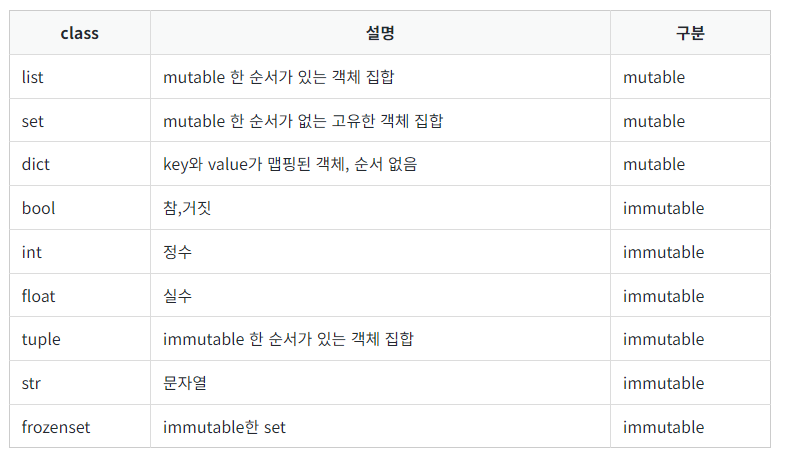

코딩을 하다보면 값을 복사하는 경우가 많이 있습니다.  
이때 다음과 같이 복사해서 사용하면 몇가지 문제가 생길 수 있습니다.

```python
a = [1, 2, [3, 4]]
b = a

# 원본 리스트 출력
print(a)        # 출력: [1, 2, [3, 4]]

print(b)    	# 출력: [1, 2, [3, 4]]

# 내부 리스트 변경
b[2][0] = 99

# 변경 후 리스트 출력
print(a)        # 출력: [1, 2, [99, 4]]
print(b)        # 출력: [1, 2, [99, 4]]
```

원하는 동작은 b 리스트의 원소를 변경하는 것인데  
a의 원소까지 바뀌어 버립니다.

<br>
이러한 문제는 머신러닝이나 인공지능의 학습에 있어
원본 데이터를 유지해야 하는 상황에서 문제가 될 수 있습니다.

<br>
## 원인

파이썬 객체(object)는 값을 바꿀 수 없는 immutable 타입과
값을 바꿀 수 있는 mutable 타입의 객체가 존재합니다.

<br>
객체 구분 표<sup><a href="#ref1">[1]</a></sup>


mutable: list, set, dict  
immuntable: bool, int, float, tuple, str, frozenset

<br>
이외에 일반 user가 작성한 class도 대부분 mutable 한 객체입니다.<sup><a href="#ref1">[1]</a></sup>

<br>
### 1-1. mutable한 객체의 변수 간 대입
- list의 얕은 복사를 확인 해봅니다.
- b에 a를 할당하면 값이 할당되는 것이 아니라 같은 메모리 주소를 바라봅니다.
- b를 변경하면 같이 a도 바뀝니다.
- mutable한 다른 객체 또한 똑같은 현상이 나타납니다.

```python
>>> a = [1, 2, 3]
>>> b = a  # shallow copy
>>> b[0] = 5
>>> a
[5, 2, 3]
>>> b
[5, 2, 3]
>>> id(a)
2495033715392
>>> id(b)
2495033715392
```

<br>
### 1-2. immutable한 객체의 변수간 대입  

- str 문자열의 얕은 복사를 확인해봅니다.
- list와 똑같이 b를 a에 할당하면 같은 메모리 주소를 바라보게 됩니다.
- 하지만 b에 다른 값을 할당하면 재할당이 이루어지며 메모리 주소가 변경됩니다.
- 고로 a와 b는 다른 값을 가집니다.

```python
>>> a = "abc"
>>> b = a
>>> a
'abc'
>>> b
'abc'
>>> id(a)
140711653173040
>>> id(b)
140711653173040
>>> b = "abcd"
>>> a
'abc'
>>> b
'abcd'
>>> id(a)
140711653173040
>>> id(b)
2495031161456
```

<br>
### 2-1. 얕은 복사 (Shallow Copy)
<code>b = a</code>와 같은 형태의 복사를 **얕은 복사 (Shallow Copy)**라고 합니다.  
<br>
얕은 복사는 객체의 참조값, 흔히 말하는 주소값만 복사하는 것을 의미합니다.  
객체의 주소값을 복사하기 때문에, 복사 대상의 값이 바뀌면 복사한 값도 바뀌게 됩니다.  
결과적으로 두 변수 간 독립성이 성립하지 않게 됩니다.<sup><a href="#ref2"">[2]</a></sup>

<br>
<br>
## 해결
### 2-2. 깊은 복사 (depp copy)
깊은 복사는 다른 메모리 공간에 값을 복사함으로써, mutable 객체의 독립성을 유지해 주는 역할을 합니다.  
copy 모듈의 deepcopy 함수를 사용하여 깊은 복사를 할 수 있습니다.  
a를 b에 깊은 복사하는 순간, a와 b의 주소값이 달라지는 것을 확인할 수 있습니다. 

```python
>>> import copy
>>> a = [[1, 2], [3, 4]]
>>> b = copy.deepcopy(a)
>>> a[1].append(5)
>>> a
[[1, 2], [3, 4, 5]]
>>> b
[[1, 2], [3, 4]]
>>> id(a)
2495033695744
>>> id(b)
2495033698048
```

<br>
<br>
### 참조 (References)
1. <a name="ref1" href="https://wikidocs.net/16038" target="_blank">12. 얕은 복사(shallow copy)와 깊은 복사(deep copy) - 파이썬</a>  
2. <a name="ref2" href="https://kevinitcoding.tistory.com/entry/%ED%8C%8C%EC%9D%B4%EC%8D%ACPython-%EC%96%95%EC%9D%80-%EB%B3%B5%EC%82%ACShallow-copy%EC%99%80-%EA%B9%8A%EC%9D%80-%EB%B3%B5%EC%82%ACdeep-copy%EC%97%90-%EB%8C%80%ED%95%9C-%EC%99%84%EB%B2%BD-%EC%A0%95%EB%A6%AC" target="_blank">[파이썬/Python] 얕은 복사(Shallow copy)와 깊은 복사(deep copy)에 대한 완벽 정리</a>  
3. <a name="ref3" href="https://wikidocs.net/91520" target="_blank">03) Immutable과 Mutable</a>  


